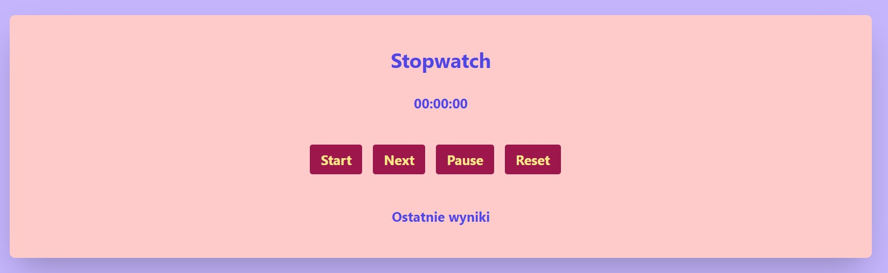

[LINK TO PROJECT](https://majakasprzyk.github.io/stop-watch/src/index.html)

This is **stopwatch**. Project made with **Java Script**.

## Functionalities:

- Start - to start the timer
- Stop - to stop the timer
- Pause - to pause the timer
- Reset - to reset the timer results without saving
- Next - to add another timer, and the previous timer result is displayed below the main timer. (As a simulation of a situation when one runner gets into a finish line and then the timer is started for another runner)
- Save - to save the timer results into localStorage

## Screen of project:

   
